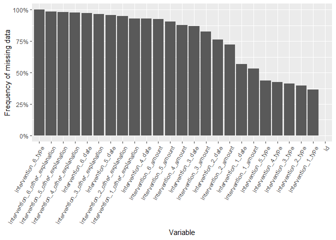

Cleaning intervention data
================
Sara Colom
2023-08-09

``` r
source("R/helpers.R")
```

Quick look at the data

``` r
int_dat %>% 
  glimpse()
```

    ## Rows: 14,690
    ## Columns: 25
    ## $ id                               <dbl> 116726, 128200, 165088, 132904, 12018…
    ## $ intervention_1_type              <chr> NA, NA, NA, NA, NA, NA, NA, NA, NA, N…
    ## $ intervention_1_other_explanation <chr> NA, NA, NA, NA, NA, NA, NA, NA, NA, N…
    ## $ intervention_1_date              <dttm> NA, NA, NA, NA, NA, NA, NA, NA, NA, …
    ## $ intervention_1_amount            <dbl> NA, NA, NA, NA, NA, NA, NA, NA, NA, N…
    ## $ intervention_2_type              <chr> NA, NA, NA, NA, NA, NA, NA, NA, NA, N…
    ## $ intervention_2_other_explanation <chr> NA, NA, NA, NA, NA, NA, NA, NA, NA, N…
    ## $ intervention_2_date              <dttm> NA, NA, NA, NA, NA, NA, NA, NA, NA, …
    ## $ intervention_2_amount            <lgl> NA, NA, NA, NA, NA, NA, NA, NA, NA, N…
    ## $ intervention_3_type              <chr> NA, NA, NA, NA, NA, NA, NA, NA, NA, N…
    ## $ intervention_3_other_explanation <chr> NA, NA, NA, NA, NA, NA, NA, NA, NA, N…
    ## $ intervention_3_date              <dttm> NA, NA, NA, NA, NA, NA, NA, NA, NA, …
    ## $ intervention_3_amount            <lgl> NA, NA, NA, NA, NA, NA, NA, NA, NA, N…
    ## $ intervention_4_type              <chr> NA, NA, NA, NA, NA, NA, NA, NA, NA, N…
    ## $ intervention_4_other_explanation <chr> NA, NA, NA, NA, NA, NA, NA, NA, NA, N…
    ## $ intervention_4_date              <dttm> NA, NA, NA, NA, NA, NA, NA, NA, NA, …
    ## $ intervention_4_amount            <lgl> NA, NA, NA, NA, NA, NA, NA, NA, NA, N…
    ## $ intervention_5_type              <chr> NA, NA, NA, NA, NA, NA, NA, NA, NA, N…
    ## $ intervention_5_other_explanation <chr> NA, NA, NA, NA, NA, NA, NA, NA, NA, N…
    ## $ intervention_5_date              <dttm> NA, NA, NA, NA, NA, NA, NA, NA, NA, …
    ## $ intervention_5_amount            <lgl> NA, NA, NA, NA, NA, NA, NA, NA, NA, N…
    ## $ intervention_6_type              <lgl> NA, NA, NA, NA, NA, NA, NA, NA, NA, N…
    ## $ intervention_6_other_explanation <chr> NA, NA, NA, NA, NA, NA, NA, NA, NA, N…
    ## $ intervention_6_date              <dttm> NA, NA, NA, NA, NA, NA, NA, NA, NA, …
    ## $ intervention_6_amount            <lgl> NA, NA, NA, NA, NA, NA, NA, NA, NA, N…

# Check data missingness

``` r
var_ls <- names(int_dat)

missing_count <- purrr::map2_df(rep(list(int_dat), length(var_ls)), var_ls, missing_count) %>% 
        mutate(across(where(is.numeric), ~round(.x, 3))) %>% 
        arrange(desc(freq_missing))

missing_count
```

<div class="kable-table">

<table>
<thead>
<tr>
<th style="text-align:left;">
variable
</th>
<th style="text-align:right;">
n_missing
</th>
<th style="text-align:right;">
freq_missing
</th>
<th style="text-align:right;">
per_missing
</th>
</tr>
</thead>
<tbody>
<tr>
<td style="text-align:left;">
intervention_6\_type
</td>
<td style="text-align:right;">
14690
</td>
<td style="text-align:right;">
1.000
</td>
<td style="text-align:right;">
100.000
</td>
</tr>
<tr>
<td style="text-align:left;">
intervention_6\_other_explanation
</td>
<td style="text-align:right;">
14460
</td>
<td style="text-align:right;">
0.984
</td>
<td style="text-align:right;">
98.434
</td>
</tr>
<tr>
<td style="text-align:left;">
intervention_5\_other_explanation
</td>
<td style="text-align:right;">
14431
</td>
<td style="text-align:right;">
0.982
</td>
<td style="text-align:right;">
98.237
</td>
</tr>
<tr>
<td style="text-align:left;">
intervention_4\_other_explanation
</td>
<td style="text-align:right;">
14355
</td>
<td style="text-align:right;">
0.977
</td>
<td style="text-align:right;">
97.720
</td>
</tr>
<tr>
<td style="text-align:left;">
intervention_6\_date
</td>
<td style="text-align:right;">
14307
</td>
<td style="text-align:right;">
0.974
</td>
<td style="text-align:right;">
97.393
</td>
</tr>
<tr>
<td style="text-align:left;">
intervention_3\_other_explanation
</td>
<td style="text-align:right;">
14205
</td>
<td style="text-align:right;">
0.967
</td>
<td style="text-align:right;">
96.698
</td>
</tr>
<tr>
<td style="text-align:left;">
intervention_5\_date
</td>
<td style="text-align:right;">
14086
</td>
<td style="text-align:right;">
0.959
</td>
<td style="text-align:right;">
95.888
</td>
</tr>
<tr>
<td style="text-align:left;">
intervention_2\_other_explanation
</td>
<td style="text-align:right;">
13977
</td>
<td style="text-align:right;">
0.951
</td>
<td style="text-align:right;">
95.146
</td>
</tr>
<tr>
<td style="text-align:left;">
intervention_1\_other_explanation
</td>
<td style="text-align:right;">
13678
</td>
<td style="text-align:right;">
0.931
</td>
<td style="text-align:right;">
93.111
</td>
</tr>
<tr>
<td style="text-align:left;">
intervention_4\_date
</td>
<td style="text-align:right;">
13652
</td>
<td style="text-align:right;">
0.929
</td>
<td style="text-align:right;">
92.934
</td>
</tr>
<tr>
<td style="text-align:left;">
intervention_6\_amount
</td>
<td style="text-align:right;">
13581
</td>
<td style="text-align:right;">
0.925
</td>
<td style="text-align:right;">
92.451
</td>
</tr>
<tr>
<td style="text-align:left;">
intervention_5\_amount
</td>
<td style="text-align:right;">
13329
</td>
<td style="text-align:right;">
0.907
</td>
<td style="text-align:right;">
90.735
</td>
</tr>
<tr>
<td style="text-align:left;">
intervention_4\_amount
</td>
<td style="text-align:right;">
12886
</td>
<td style="text-align:right;">
0.877
</td>
<td style="text-align:right;">
87.720
</td>
</tr>
<tr>
<td style="text-align:left;">
intervention_3\_date
</td>
<td style="text-align:right;">
12816
</td>
<td style="text-align:right;">
0.872
</td>
<td style="text-align:right;">
87.243
</td>
</tr>
<tr>
<td style="text-align:left;">
intervention_3\_amount
</td>
<td style="text-align:right;">
12168
</td>
<td style="text-align:right;">
0.828
</td>
<td style="text-align:right;">
82.832
</td>
</tr>
<tr>
<td style="text-align:left;">
intervention_2\_date
</td>
<td style="text-align:right;">
11217
</td>
<td style="text-align:right;">
0.764
</td>
<td style="text-align:right;">
76.358
</td>
</tr>
<tr>
<td style="text-align:left;">
intervention_2\_amount
</td>
<td style="text-align:right;">
10637
</td>
<td style="text-align:right;">
0.724
</td>
<td style="text-align:right;">
72.410
</td>
</tr>
<tr>
<td style="text-align:left;">
intervention_1\_date
</td>
<td style="text-align:right;">
8341
</td>
<td style="text-align:right;">
0.568
</td>
<td style="text-align:right;">
56.780
</td>
</tr>
<tr>
<td style="text-align:left;">
intervention_1\_amount
</td>
<td style="text-align:right;">
7831
</td>
<td style="text-align:right;">
0.533
</td>
<td style="text-align:right;">
53.308
</td>
</tr>
<tr>
<td style="text-align:left;">
intervention_5\_type
</td>
<td style="text-align:right;">
6409
</td>
<td style="text-align:right;">
0.436
</td>
<td style="text-align:right;">
43.628
</td>
</tr>
<tr>
<td style="text-align:left;">
intervention_4\_type
</td>
<td style="text-align:right;">
6231
</td>
<td style="text-align:right;">
0.424
</td>
<td style="text-align:right;">
42.417
</td>
</tr>
<tr>
<td style="text-align:left;">
intervention_3\_type
</td>
<td style="text-align:right;">
6035
</td>
<td style="text-align:right;">
0.411
</td>
<td style="text-align:right;">
41.082
</td>
</tr>
<tr>
<td style="text-align:left;">
intervention_2\_type
</td>
<td style="text-align:right;">
5830
</td>
<td style="text-align:right;">
0.397
</td>
<td style="text-align:right;">
39.687
</td>
</tr>
<tr>
<td style="text-align:left;">
intervention_1\_type
</td>
<td style="text-align:right;">
5344
</td>
<td style="text-align:right;">
0.364
</td>
<td style="text-align:right;">
36.378
</td>
</tr>
<tr>
<td style="text-align:left;">
id
</td>
<td style="text-align:right;">
2
</td>
<td style="text-align:right;">
0.000
</td>
<td style="text-align:right;">
0.014
</td>
</tr>
</tbody>
</table>

</div>

Display data missing-ness.

``` r
missing_count %>% 
  ggplot(aes(reorder(variable, -freq_missing), freq_missing)) +
  geom_bar(stat = "identity") +
  theme(axis.text.x = element_text(angle = 60, vjust = 1, hjust = 1)) +
  ylab("Frequency of missing data") +
  xlab("Variable") +
  scale_y_continuous(labels = scales::percent) 
```

<!-- -->

Counts of intervention types.

``` r
int_type <- int_dat %>% 
        select(id, matches("type")) %>% 
        pivot_longer(matches("type"), names_to = "intervention") %>% 
        filter(!is.na(value)) %>% 
        mutate(value = clean_characters(value))

int_type %>% 
  count(value)
```

<div class="kable-table">

<table>
<thead>
<tr>
<th style="text-align:left;">
value
</th>
<th style="text-align:right;">
n
</th>
</tr>
</thead>
<tbody>
<tr>
<td style="text-align:left;">
\#
</td>
<td style="text-align:right;">
2
</td>
</tr>
<tr>
<td style="text-align:left;">
0
</td>
<td style="text-align:right;">
29
</td>
</tr>
<tr>
<td style="text-align:left;">
1)fiduciary services- client enrolled fbill pay 2)legal services- bill
consolidation services-
</td>
<td style="text-align:right;">
1
</td>
</tr>
<tr>
<td style="text-align:left;">
2500 paid ffirst month’s rent/last month’s rent and pet deposit
</td>
<td style="text-align:right;">
1
</td>
</tr>
<tr>
<td style="text-align:left;">
44593
</td>
<td style="text-align:right;">
1
</td>
</tr>
<tr>
<td style="text-align:left;">
5150 fgravely disabled and client abandonment
</td>
<td style="text-align:right;">
1
</td>
</tr>
<tr>
<td style="text-align:left;">
911 hazmat clean up to address hoard conditions
</td>
<td style="text-align:right;">
1
</td>
</tr>
<tr>
<td style="text-align:left;">
advocacy to get client into medical respite emergency shelter
</td>
<td style="text-align:right;">
1
</td>
</tr>
<tr>
<td style="text-align:left;">
advocacy to get into homeless shelter.
</td>
<td style="text-align:right;">
1
</td>
</tr>
<tr>
<td style="text-align:left;">
assisted client through case management - med-ca -ihss -legal assistance
to remove suspected abuser
</td>
<td style="text-align:right;">
1
</td>
</tr>
<tr>
<td style="text-align:left;">
back rent
</td>
<td style="text-align:right;">
1
</td>
</tr>
<tr>
<td style="text-align:left;">
caregiver services/respite
</td>
<td style="text-align:right;">
1
</td>
</tr>
<tr>
<td style="text-align:left;">
caregiver services/respite care
</td>
<td style="text-align:right;">
234
</td>
</tr>
<tr>
<td style="text-align:left;">
case management
</td>
<td style="text-align:right;">
6
</td>
</tr>
<tr>
<td style="text-align:left;">
check to client to cover baggage fees and travel
</td>
<td style="text-align:right;">
1
</td>
</tr>
<tr>
<td style="text-align:left;">
client did not have a sustainable plan so referred her to amih/to search
froomate
</td>
<td style="text-align:right;">
1
</td>
</tr>
<tr>
<td style="text-align:left;">
client left snf due to covid fears returned to his car. advocated to get
client into shelter
</td>
<td style="text-align:right;">
1
</td>
</tr>
<tr>
<td style="text-align:left;">
counseling referral fhoarding to asoc partners
</td>
<td style="text-align:right;">
1
</td>
</tr>
<tr>
<td style="text-align:left;">
damages/repairs
</td>
<td style="text-align:right;">
1
</td>
</tr>
<tr>
<td style="text-align:left;">
deep cleaning
</td>
<td style="text-align:right;">
398
</td>
</tr>
<tr>
<td style="text-align:left;">
deep cleaning/hoarding assistance
</td>
<td style="text-align:right;">
85
</td>
</tr>
<tr>
<td style="text-align:left;">
emergency shelter
</td>
<td style="text-align:right;">
1529
</td>
</tr>
<tr>
<td style="text-align:left;">
emergency shelter/winter weather assistance
</td>
<td style="text-align:right;">
1
</td>
</tr>
<tr>
<td style="text-align:left;">
enhanced case manage.
</td>
<td style="text-align:right;">
1
</td>
</tr>
<tr>
<td style="text-align:left;">
enhanced case management
</td>
<td style="text-align:right;">
3150
</td>
</tr>
<tr>
<td style="text-align:left;">
essential furniture
</td>
<td style="text-align:right;">
1
</td>
</tr>
<tr>
<td style="text-align:left;">
external housing navigation
</td>
<td style="text-align:right;">
524
</td>
</tr>
<tr>
<td style="text-align:left;">
fiduciary support while clients fiances are rerouted
</td>
<td style="text-align:right;">
1
</td>
</tr>
<tr>
<td style="text-align:left;">
flight to family in washington
</td>
<td style="text-align:right;">
1
</td>
</tr>
<tr>
<td style="text-align:left;">
furniture
</td>
<td style="text-align:right;">
1
</td>
</tr>
<tr>
<td style="text-align:left;">
home habitability
</td>
<td style="text-align:right;">
81
</td>
</tr>
<tr>
<td style="text-align:left;">
home repair
</td>
<td style="text-align:right;">
298
</td>
</tr>
<tr>
<td style="text-align:left;">
hotel stay
</td>
<td style="text-align:right;">
1
</td>
</tr>
<tr>
<td style="text-align:left;">
housing navigation
</td>
<td style="text-align:right;">
225
</td>
</tr>
<tr>
<td style="text-align:left;">
housing navigator
</td>
<td style="text-align:right;">
64
</td>
</tr>
<tr>
<td style="text-align:left;">
housing search
</td>
<td style="text-align:right;">
1
</td>
</tr>
<tr>
<td style="text-align:left;">
hs-moving expenses
</td>
<td style="text-align:right;">
2
</td>
</tr>
<tr>
<td style="text-align:left;">
intensive case management
</td>
<td style="text-align:right;">
12
</td>
</tr>
<tr>
<td style="text-align:left;">
intrem housing
</td>
<td style="text-align:right;">
1
</td>
</tr>
<tr>
<td style="text-align:left;">
jan-march rental subsidy
</td>
<td style="text-align:right;">
2
</td>
</tr>
<tr>
<td style="text-align:left;">
legal services
</td>
<td style="text-align:right;">
296
</td>
</tr>
<tr>
<td style="text-align:left;">
located room and board femergency placement-
</td>
<td style="text-align:right;">
1
</td>
</tr>
<tr>
<td style="text-align:left;">
located room and board- client met gravely disabled hold after a fall in
hoard
</td>
<td style="text-align:right;">
1
</td>
</tr>
<tr>
<td style="text-align:left;">
missing persons report filed
</td>
<td style="text-align:right;">
1
</td>
</tr>
<tr>
<td style="text-align:left;">
mortgage payment
</td>
<td style="text-align:right;">
64
</td>
</tr>
<tr>
<td style="text-align:left;">
moved client to memory care unit/probate conservator-ship granted
</td>
<td style="text-align:right;">
1
</td>
</tr>
<tr>
<td style="text-align:left;">
moving company
</td>
<td style="text-align:right;">
1
</td>
</tr>
<tr>
<td style="text-align:left;">
moving company to relocate clients
</td>
<td style="text-align:right;">
1
</td>
</tr>
<tr>
<td style="text-align:left;">
moving cost assistance
</td>
<td style="text-align:right;">
9
</td>
</tr>
<tr>
<td style="text-align:left;">
n/a
</td>
<td style="text-align:right;">
1
</td>
</tr>
<tr>
<td style="text-align:left;">
name change
</td>
<td style="text-align:right;">
1
</td>
</tr>
<tr>
<td style="text-align:left;">
no
</td>
<td style="text-align:right;">
89
</td>
</tr>
<tr>
<td style="text-align:left;">
no intervention
</td>
<td style="text-align:right;">
28547
</td>
</tr>
<tr>
<td style="text-align:left;">
none
</td>
<td style="text-align:right;">
1
</td>
</tr>
<tr>
<td style="text-align:left;">
other
</td>
<td style="text-align:right;">
2126
</td>
</tr>
<tr>
<td style="text-align:left;">
other financial assistance
</td>
<td style="text-align:right;">
4
</td>
</tr>
<tr>
<td style="text-align:left;">
payee/fiduciary service
</td>
<td style="text-align:right;">
1
</td>
</tr>
<tr>
<td style="text-align:left;">
project go- utilities assistance program
</td>
<td style="text-align:right;">
1
</td>
</tr>
<tr>
<td style="text-align:left;">
purchased cell phones due to rural location and high fall risk
</td>
<td style="text-align:right;">
1
</td>
</tr>
<tr>
<td style="text-align:left;">
relocation
</td>
<td style="text-align:right;">
10
</td>
</tr>
<tr>
<td style="text-align:left;">
relocation assistance/storage
</td>
<td style="text-align:right;">
591
</td>
</tr>
<tr>
<td style="text-align:left;">
rent assistance
</td>
<td style="text-align:right;">
1
</td>
</tr>
<tr>
<td style="text-align:left;">
rent back- pay
</td>
<td style="text-align:right;">
7
</td>
</tr>
<tr>
<td style="text-align:left;">
rent back-pay
</td>
<td style="text-align:right;">
430
</td>
</tr>
<tr>
<td style="text-align:left;">
rent payment
</td>
<td style="text-align:right;">
1640
</td>
</tr>
<tr>
<td style="text-align:left;">
rental arrears
</td>
<td style="text-align:right;">
1
</td>
</tr>
<tr>
<td style="text-align:left;">
rental assistance
</td>
<td style="text-align:right;">
197
</td>
</tr>
<tr>
<td style="text-align:left;">
rental assistance/temp housing
</td>
<td style="text-align:right;">
1
</td>
</tr>
<tr>
<td style="text-align:left;">
reunification
</td>
<td style="text-align:right;">
1
</td>
</tr>
<tr>
<td style="text-align:left;">
scheduled client fcataracts surgery
</td>
<td style="text-align:right;">
1
</td>
</tr>
<tr>
<td style="text-align:left;">
security deposit
</td>
<td style="text-align:right;">
566
</td>
</tr>
<tr>
<td style="text-align:left;">
taxes paid fmobile home purchase using hmoit fund
</td>
<td style="text-align:right;">
1
</td>
</tr>
<tr>
<td style="text-align:left;">
temp housing/rental asst
</td>
<td style="text-align:right;">
1
</td>
</tr>
<tr>
<td style="text-align:left;">
temporary housing
</td>
<td style="text-align:right;">
1602
</td>
</tr>
<tr>
<td style="text-align:left;">
tow service to move mobile home
</td>
<td style="text-align:right;">
1
</td>
</tr>
<tr>
<td style="text-align:left;">
transportation
</td>
<td style="text-align:right;">
4
</td>
</tr>
<tr>
<td style="text-align:left;">
unknown
</td>
<td style="text-align:right;">
203
</td>
</tr>
<tr>
<td style="text-align:left;">
utilities
</td>
<td style="text-align:right;">
495
</td>
</tr>
<tr>
<td style="text-align:left;">
utility deposit
</td>
<td style="text-align:right;">
1
</td>
</tr>
<tr>
<td style="text-align:left;">
utility payments
</td>
<td style="text-align:right;">
13
</td>
</tr>
<tr>
<td style="text-align:left;">
worked with placement agency to locate a room and board established
clients services in california from mississippi - med-
cal/med-care/id/ihss/social security benefits review.
</td>
<td style="text-align:right;">
1
</td>
</tr>
<tr>
<td style="text-align:left;">
worked with real estate to sell property as is
</td>
<td style="text-align:right;">
1
</td>
</tr>
<tr>
<td style="text-align:left;">
yes
</td>
<td style="text-align:right;">
20
</td>
</tr>
</tbody>
</table>

</div>
